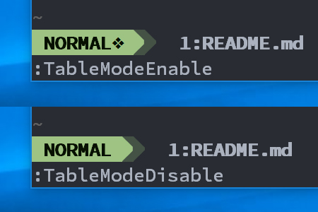

# airline-tablemode.vim



[airline.vim](https://github.com/bling/vim-airline) extension that
indicates whether [vim-table-mode](https://github.com/dhruvasagar/vim-table-mode) is enabled

## Install

### Pathogen (Linux)

```vimL
git clone https://github.com/retorillo/airline-tablemode.vim.git ~/.vim/bundle/airline-tablemode.vim
```

### Pathogen (Windows/PowerShell)

```vimL
git clone https://github.com/retorillo/airline-tablemode.vim.git $home/vimfiles/bundle/airline-tablemode.vim
```

## Options

```vimL
g:airline#extensions#tablemode#symbol = "Your custom symbol or message"
```

## License

Copyright (C) Retorillo

Distributed under the the MIT license
